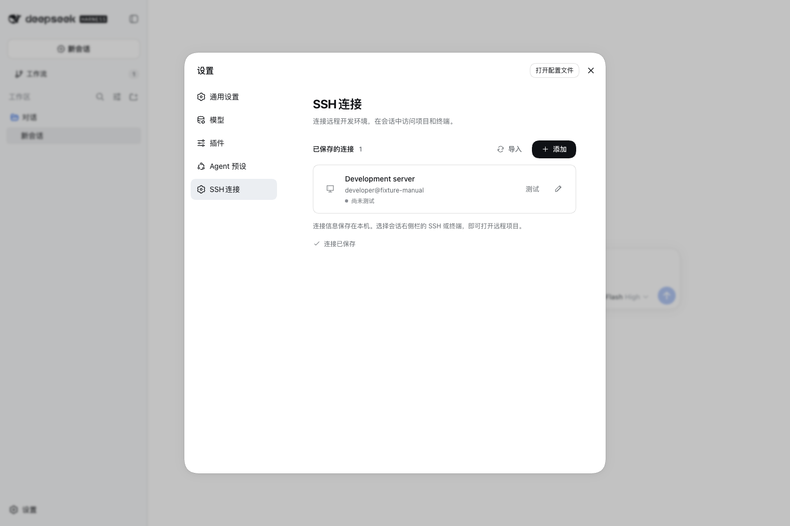
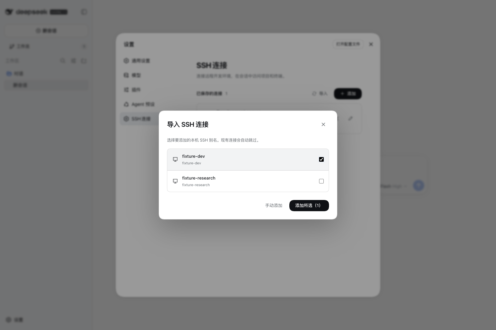
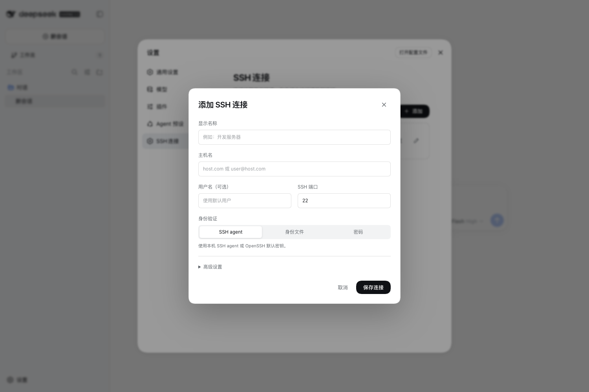
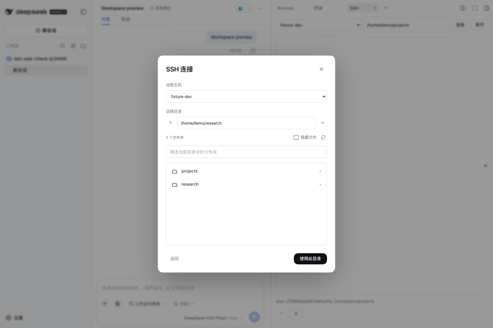
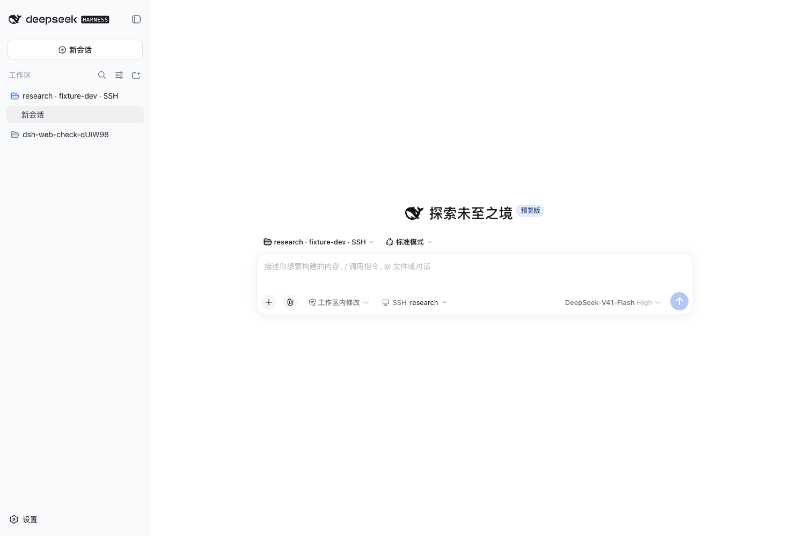
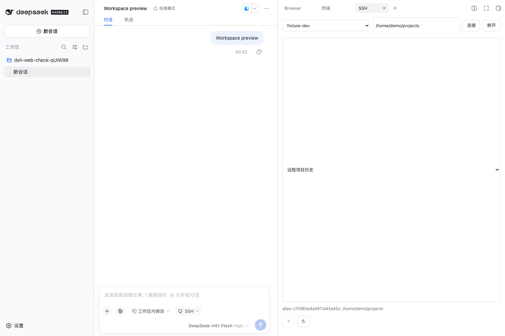

# DSH SSH Plugin

[中文（主文档）](README.md)

SSH connections, remote workspaces, directory selection, and remote file operations for DeepSeek Harness Desktop. Settings, the composer, and the right file panel share the active remote project.

## Host support

This repository targets the official [DeepSeek Harness Desktop](https://github.com/deepseek-ai/deepseek-harness). The integrated edition is maintained separately in [DSH Omni](https://github.com/hzxwonder/dsh-omni). Active maintenance covers these two desktop products.

Compatibility is tracked against the official signed macOS arm64 **0.1.7-rc.2** build. See the [acceptance report and feature comparison](https://github.com/hzxwonder/dsh-omni/blob/main/docs/official-desktop-compatibility.md) for installation, activation, restart and functional results. Installation alone does not establish compatibility.

Validate changes in DSH Omni, update its repository, then adapt and validate in official Desktop before publishing this plugin. Repeat real-device validation after each build.

## Install

Requires Node.js 22.19+, local OpenSSH, and remote Python 3. Use the same DSH_HOME for installation and startup:

~~~sh
git clone https://github.com/hzxwonder-dsh-plugins/dsh-plugin-ssh.git
cd dsh-plugin-ssh
npm ci
dsh plugin --profile migration add "file:$PWD"
~~~

Keep the file: prefix to install dependencies. Restart Harness after installing or editing the plugin; connection settings apply live. Verify the server fingerprint in a system terminal and establish a trusted known_hosts entry before connecting.

### Distribution

This repository is the public adapter for the official DeepSeek Harness Desktop. DSH Omni ships its integrated copy from the pinned `vendor/dsh-plugin-ssh` snapshot in [dsh-omni](https://github.com/hzxwonder/dsh-omni). The two editions share the plugin capability but are validated against their hosts separately. Web is no longer a maintenance target. See the [compatibility report](https://github.com/hzxwonder/dsh-omni/blob/main/docs/official-desktop-compatibility.md) for the current official Desktop result.

## Connections

Open Settings → SSH Connections to add a connection or import selected aliases. Discovery reads concrete aliases from ~/.ssh/config and bounded Include files. Import preserves existing names and settings. Loading failures display an error and a retry action.

The form supports display name, host, account, port, SSH agent, identity file, and password authentication. Advanced settings include a default directory (~ or an absolute path), jump host, timeout, and keepalive interval.

Enter passwords only in the settings form. Temporary passwords remain in process memory; remembered passwords use the Harness local credential service. Settings and tool results do not contain password values.

## Remote workspaces and sessions

Choose Add Workspace → Remote Workspace, select a connection, and browse to a directory. The picker supports direct path entry, parent navigation, refresh, filtering, and hidden directories. Confirming creates a workspace and session. New sessions in that workspace inherit its remote target, which persists across reloads.

In an existing session, type `/ssh` and press Enter to open the same picker. The selected directory is inserted into the prompt as a PI-Desktop-style inline reference chip. Click the chip to choose again; detaching affects only the current session.

The model uses the ssh tool for remote files and commands. Install [DSH Terminal](https://github.com/hzxwonder-dsh-plugins/dsh-plugin-terminal) for interactive shells. Ordinary local file and shell tools continue to operate on the local machine; the remote target does not redirect them.

## Tools and commands

| Actions | Purpose |
| --- | --- |
| connections, import, save_connection, remove_connection | Manage saved connections |
| connect, probe, hosts | Probe connections and discover hosts |
| setTarget, getTarget, clearTarget, projects | Session targets and project history |
| listFiles / list, readFile / read, write | Remote directories and files |
| exec | Remote commands with bounded output and exit status |
| passwordStatus | Check whether a password is configured |

Select a connection with connectionId or target: {connectionId, path}. Calls without a connection selector inherit the session target. File paths are relative to root; text is capped at 64 KiB. Read before writing and pass its revision as baseRevision, or "missing" to create a file.

~~~json
{"action":"readFile","connectionId":"dev","root":"/srv/project","path":"README.md"}
~~~

Commands with arguments remain available:

~~~text
/ssh list
/ssh import
/ssh connect <connection-id> [~|/absolute/root]
/ssh <host> <absolute-remote-root>
~~~

Connection commands verify the directory and can bind the current session when using a saved connection. Command and model-tool mutations follow Harness sandbox and approval policy.

## Runtime boundaries

OpenSSH enforces strict host-key checks. File operations stay within the selected root and reject traversal, symlinks, hard links, and reserved lock paths. Writes use revision checks and atomic replacement. The picker permits explicit root changes. Remote commands run with the remote account's permissions; root is their working directory.

Read-only mode blocks configuration changes, target binding, file writes, and remote commands. Web actions use an authenticated Harness connection; constrained model actions additionally require approval. Interrupted operations can leave an unknown remote outcome; inspect before retrying writes.

## Verification and development

~~~sh
npm test
~~~

Tests cover alias import, authentication transport, the file protocol, safety boundaries, Web routes, workspace inheritance, and explicit detach. Screenshots come from Harness Web running in local Chrome with synthetic remote data. Real-server authentication requires the separate [acceptance checks](docs/e2e.md).

- [Interface and storage contract](docs/spec.md)
- [Screenshot provenance](docs/screenshots/SOURCES.md)

LGPL-3.0-only. The implementation follows PI-Desktop remote-workspace interactions and uses official DeepSeek Harness services. See [NOTICE](NOTICE) for attribution.
